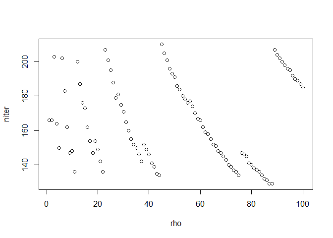
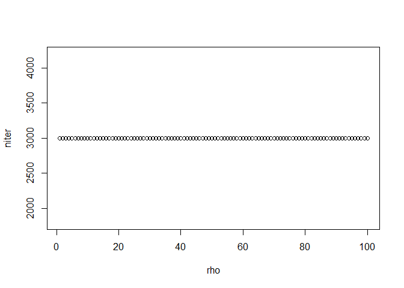

### ADMM

`ADMM` is an R package to solve Lasso-like problems using the ADMM algorithm.

### Comparison

Comparing `ADMM` with `glmnet`


```r
library(glmnet)
```

```
## Loading required package: Matrix
## Loaded glmnet 1.9-8
```

```r
library(ADMM)
set.seed(123)
n <- 100
p <- 10
m <- 5
b <- matrix(c(runif(m), rep(0, p - m)))
x <- matrix(rnorm(n * p, sd = 2), n, p)
y <- x %*% b + rnorm(n)

## non-standardized
fit <- glmnet(x, y, standardize = FALSE, intercept = FALSE)
out_glmnet <- coef(fit, s = exp(-2), exact = TRUE)
out_admm <- admm_lasso(x, y, exp(-2), rho = 10)
data.frame(glmnet = out_glmnet[-1], admm = out_admm$coef)
```

```
##          glmnet         admm
## 1   0.191276333  0.191273320
## 2   0.768951956  0.768950559
## 3   0.400495704  0.400495040
## 4   0.937123951  0.937123468
## 5   0.827245364  0.827245585
## 6   0.000000000  0.000000000
## 7   0.028758698  0.028758960
## 8  -0.067186179 -0.067186075
## 9   0.095128164  0.095128163
## 10  0.006433896  0.006434543
```

```r
## standardized 
# glmnet use standardized parameter
fit1 <- glmnet(x, y, standardize = TRUE, intercept = FALSE)
out_glmnet1 <- coef(fit1, s = exp(-2), exact = TRUE)
# glmnet don't use standardized parameter, standardizing data by yourself
x0 <- scale(x) * sqrt((n - 1) / n)
fit2 <- glmnet(x0, y, standardize = FALSE, intercept = FALSE)
out_glmnet2 <- coef(fit2, s = exp(-2), exact = TRUE)[-1] / apply(x, 2, function(x) sd(x) * sqrt((n - 1) / n))
out_admm1 <- admm_lasso(x0, y, exp(-2), rho = 10)$coef / apply(x, 2, function(x) sd(x) * sqrt((n - 1) / n))

data.frame(glmnet_std = out_glmnet1[-1], glmnet_mystd = out_glmnet2, admm_mystd = out_admm1)
```

```
##     glmnet_std glmnet_mystd  admm_mystd
## 1   0.16596899   0.16507154  0.16506980
## 2   0.72811571   0.73710033  0.73709984
## 3   0.37148121   0.36823063  0.36823005
## 4   0.90687589   0.91346770  0.91346731
## 5   0.81043176   0.80569489  0.80569474
## 6   0.00000000   0.00000000  0.00000000
## 7   0.00000000   0.00000000  0.00000000
## 8  -0.03597691  -0.03837157 -0.03837159
## 9   0.06289898   0.07195631  0.07195676
## 10  0.00000000   0.00000000  0.00000000
```

### rho setting


```r
rho <- 1:100
niter <- sapply(rho, function(i) admm_lasso(x, y, exp(-2), maxit = 3000L, rho = i)$niter)
plot(rho, niter)
```

 

### Performance


```r
# High dimension, small sample
set.seed(123)
n <- 100
p <- 3000
m <- 10
b <- matrix(c(runif(m), rep(0, p - m)))
x <- matrix(rnorm(n * p, sd = 2), n, p)
y <- x %*% b + rnorm(n)

system.time(
    res1 <- coef(glmnet(x, y, standardize = FALSE, intercept = FALSE),
                 s = exp(-2), exact = TRUE)
)
```

```
##    user  system elapsed 
##    0.50    0.02    0.51
```

```r
system.time(res2 <- admm_lasso(x, y, exp(-2)))
```

```
##    user  system elapsed 
##    0.36    0.00    0.36
```

```r
range(as.numeric(res1)[-1] - res2$coef)
```

```
## [1] -0.08215284  0.06290741
```

### rho setting


```r
rho <- 1:100
niter <- sapply(rho, function(i) admm_lasso(scale(x), y, exp(-2), maxit = 3000L, rho = i)$niter)
plot(rho, niter)
```

 
